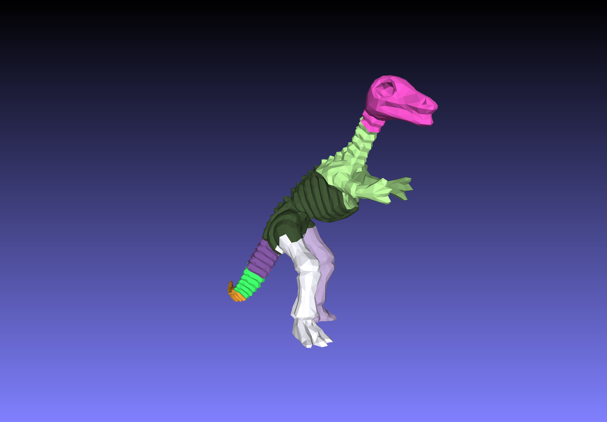
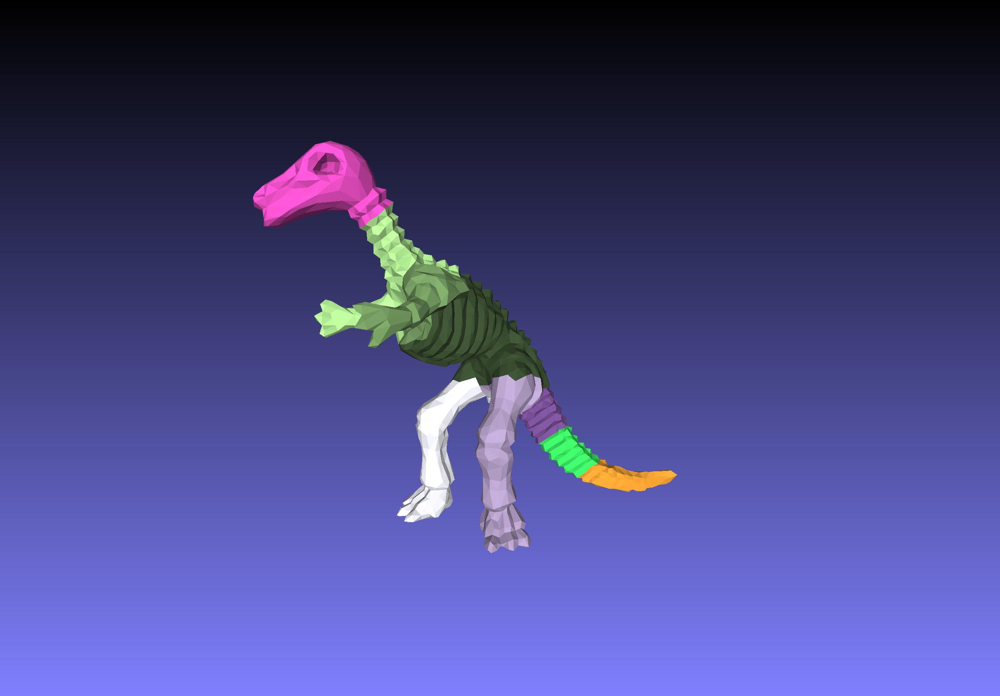
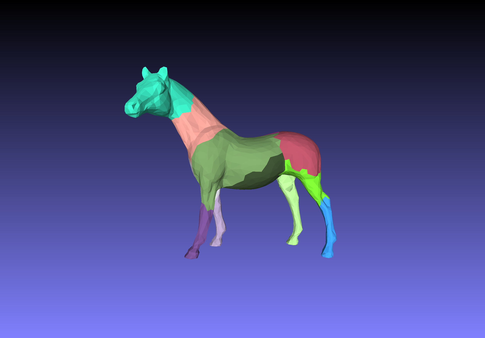
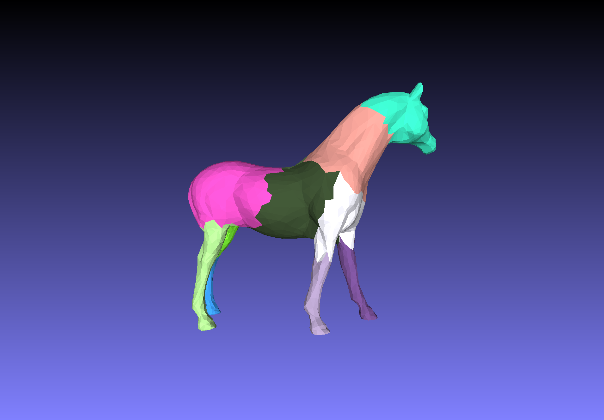

# mesh-decomposition

C++实现层次化K路分割，算法来源于《Hierarchical Mesh Decomposition using Fuzzy Clustering and Cuts》，来自2013年TOG。

编译：

```shell
g++ -o main common.cpp common.cpp model.cpp solver.cpp main.cpp -Wall -O3 -fopenmp
```

运行：

```shell
./main
```

通过修改main.cpp文件中路径来修改模型。


## 分割结果

程序生成分割后的PLY文件，通过MeshLab可视化。

恐龙模型：





马模型：




